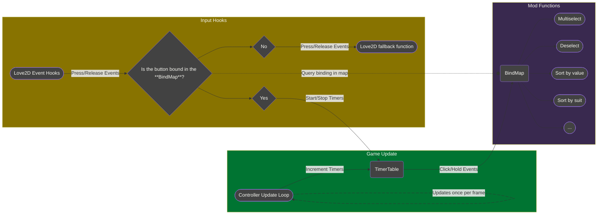

# Contributing

## Welcome

Welcome to the BMAG (Better Mouse and Gamepad) Contributing Guide, and thank you
for your interest.

## Overview

The purpose of BMAG is to extend the current *Balatro* control schema to be more
comfortable and ergonomic. It allows for binding custom buttons to a set of in-game
functions, making the controls more fluid than in the base game.

### Mod flowchart

This is the general route the mod takes to process input, starting from the Love2D
event hooks. It is in [Mermaid](https://mermaidchart.com/) format. Contributors
can view the graph online by using [their web viewer](https://mermaidchart.com/play).



## Ground rules

Before contributing, read our
[Code of Conduct](https://github.com/uptudev/bmag/blob/main/CODE_OF_CONDUCT.md)
to learn more about our community guidelines and expectations.

## Community engagement

Refer to the following channels to connect to fellow contributors or to stay up-to-date
with news about BMAG:

* Join our project contributors on
[LiberaChat](https://libera.chat/)
at `#BMAG`.

## Share ideas

To share your new ideas for the project, perform the following actions:

1. Open a *Feature Request*
[GitHub Issue](https://github.com/uptudev/bmag/issues).
1. Wait for a maintainer to consider the potential feature.
1. If we close the feature request without implementing it, do not open
another one. We will close it as a duplicate without enough reasoning behind
reopening it.

## Before you start

Before you start contributing, ensure you have the following:

* `git`, preferably a somewhat up-to-date version with `git-hooks` support,
* a POSIX-compliant shell for the `post-checkout` script,
* a copy of *Balatro* for testing your code, and
* (optional) the *Lua* interpreter

## Environment setup

To set up your environment, perform the following actions:

1. Clone the repository with either:
    1. `git clone https://github.com/uptudev/bmag` (HTTPS), or
    1. `git clone git@github.com:uptudev/bmag` (SSH)
1. Bootstrap the `git commit` template and `git-hooks` by running `./.dev/bootstrap.sh`.
This script:
    1. Sets up `git` `Signed-off-by:` trailers indicating commit author,
    1. Sets `git commit` template for the repository to `./.dev/commit-template`,
    and
    1. Copies the contents of `./.dev/hooks/` to `./.git/hooks/`.

**Ensure that you skim through `./.dev/bootstrap.sh` before running it, as you
should never run an unfamiliar script that you found on the internet.**

### Troubleshoot

If you run into any issues when setting up your environment, message me through GitHub
or through IRC *(Internet Relay Chat)* group on
[LiberaChat](https://libera.chat/)
at `#BMAG`.

## Best practices

Our project uses the
[Olivine Labs Lua style guide](https://github.com/Olivine-Labs/lua-style-guide)
as our parent guide for best practices. Reference the guide to familiarize yourself
with the best practices we want contributors to follow. We might make exceptions
provided that potential contributors make them compliant before the final review.

Documentation must follow the rules in the
[Red Hat supplementary style guide for documentation](https://redhat-documentation.github.io/supplementary-style-guide/).
This guide lays out a consistent style for writing clear documentation, and whenever
writing code comments, documentation, or any front-facing interfaces, ensure that
you follow these guidelines for clarity and concision.

## Contribution workflow

### Report issues and bugs

To report a bug, open a *Bug Report*
[GitHub Issue](https://github.com/uptudev/bmag/issues).
Please follow all instructions within the report template.

### Commit messages

Commit messages are automatically made compliant with
[Conventional Commits v1](https://www.conventionalcommits.org/en/v1.0.0/)
by the `commit-template` file and the `commit-msg` `git-hook`, but if this does
not work, they must be of the following format:

```text
<type>(scope): <description>

# See Conventional Commits for more info on commit header formatting
# https://www.conventionalcommits.org/

create:
+ `./foo`: add a file that does something

modify:
* `./bar`: change the contents of the file

delete:
- `./baz`: remove the file

Signed-off-by: [username] <[email]>
```

### Pull requests

Pull requests must contain massages in the following format:

```markdown
## Describe your changes

## Issue ticket number and link (if applicable)

## Checklist before requesting a review
- [ ] I have performed a self-review of my code.
- [ ] If it is a core feature, I have added thorough tests.
- [ ] Will this be part of a product update? If yes, please write one phrase
about this update below.
```

### Releases

Release naming follows [Semantic Versioning](https://semver.org/).
When packaging a release archive, include only the following files:

* `./src/`: the source code directory
* `./bmag.json`: stores mod metadata
* `./CHANGELOG.md`: tracks changes between release versions; is compliant with
[Keep A Changelog](https://keepachangelog.com/)
* `./LICENSE`: any distributed source code must have a copy of the license file
* `./README.md`: user guide for the mod

Release archives should not contain any other files.
Release naming convention is of the following form:
`bmag_v<VERSION>.<EXTENSION>`, for example: `bmag_v2.0.0.tar.xz` or `bmag_v2.0.0.zip`.

### Text formats

Keep all files in UTF-8 for portability. Also ensure `git` handles `CRLF`
correctly according to your platform so as to not corrupt source code when
pushing to the repository.

---

We heavily base our contribution guidelines off of
[The Good Docs Project's contributing guide template](https://gitlab.com/tgdp/templates/-/blob/main/contributing-guide/template_contributing-guide.md).
